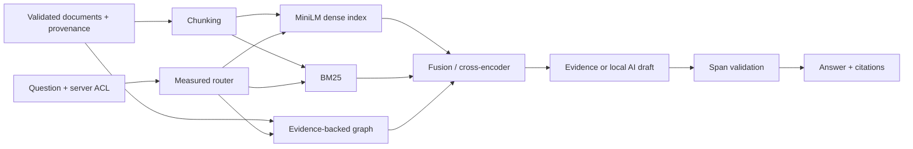

# TraceLedger
### Grounded project intelligence for complex technical programs

Project teams accumulate decisions, risk registers, incident reports and lessons faster than they can reuse them. **TraceLedger retrieves the evidence, connects documented relationships and shows the source behind an answer.** Microgrid projects provide the first demonstration domain; every operational project record is clearly fictional.

This repository is a working local portfolio system with measured retrieval experiments, a FastAPI service, browser UI, source-grounded graph, local inference, security tests and reproducible benchmark reports. It is not an enterprise deployment or a claim of independently validated answer quality.

## New: investigate the decision trail

Switch between **Quick answer** and **Investigate**, choose Documents / Email / Slack / Teams, and inspect the actual search and thread-reading activity behind cited evidence. The bounded investigator uses an evidence-driven deterministic controller, **not an LLM planner**. Conversation feeds contain 72 fictional messages and support reviewed local exports; live accounts are not connected.

Try: **“Investigate Project Alpha: why was commissioning delayed, who approved the change, and was the schedule updated?”** Then disable Email and inspect the approval gap. Source cards show provenance and let you read the full record. Voice input and read-aloud remain available.

On six held-out synthetic investigations plus one missing-ID case, first-five **cited-document** recall improved from **47.6% to 71.4%**, with search/tool p95 increasing from **402 ms to 644 ms**. This separate, small investigation cohort is not the original retrieval benchmark below and is not evidence of general enterprise accuracy. MRR remained 1.0 in both approaches.

See [investigation architecture, measured results and limits](docs/agentic-investigation.md) and [conversation imports](docs/conversation-feeds.md).

## Demo first

Start the app and open **http://127.0.0.1:8000**. Use the workflow cards:

- “What caused Project Alpha to fall behind its commissioning schedule?”
- “Trace the requirement and incident linked to CR-001.”
- “Which active projects use the equipment affected by INC-001, and what lesson follows that incident?”
- “What should we learn from Project Alpha before releasing a purchase order?”
- “What triggers RISK-001 and what response is planned?”

The interface displays exact source excerpts, fictional/public labels and graph evidence. Local AI mode runs FLAN-T5-small, checks its draft against source spans, and falls back to excerpts when validation fails. **Source excerpts remain the default because the small model was less complete.** See the [usage examples](docs/usage-examples.md).

## Real measured results

Executed locally on Windows, Python 3.12, CPU inference with two model threads. Five unique documents per query; model sessions warmed, answer caching disabled. Full per-query data, corpus hashes and model revisions are in [reports](reports/). Hardware/electricity costs are unmeasured; measured external API spend was $0.

| Configuration | Recall@5 | MRR@5 | nDCG@5 | Retrieval p95 ms |
|---|---:|---:|---:|---:|
| Synthetic held-out / vector baseline | 0.642 | 0.615 | 0.553 | 17.4 |
| Synthetic held-out / selected router | 0.861 | 0.886 | 0.813 | 293.2 |
| TechQA sample / vector baseline | 0.800 | 0.607 | 0.630 | 18.0 |
| TechQA sample / selected hybrid + reranker | 0.867 | 0.658 | 0.688 | 1635.6 |
| DOE reference diagnostic / selected | 1.000 | 1.000 | 1.000 | 425.3 |

Synthetic final test: 57 questions, 54 answerable. Development: a separate 57 questions. The TechQA test is only 40 sampled RAGBench rows pooled into 200 context documents, **not an official benchmark score**. DOE diagnostic: six questions, too small for a generalization claim.

Held-out citation span integrity: **100.0%**. Citation relevance accuracy: **56.3%**. Gold-term answer coverage: **82.4%**. These differ: a verbatim quote can still be irrelevant. Exact-quote faithfulness is a mechanical proxy, not a human or independent LLM judgment.

Local FLAN evaluation: 54/57 queries produced a fully accepted literal draft. Displayed answer coverage was 40.7%; total p95 was 499.6 ms. Rejected drafts fall back to evidence; see [raw generation results](reports/generation.json). Do not claim a zero hallucination rate from this validation rule.

### What earned its place

| Configuration | Recall@5 | MRR@5 | nDCG@5 | Retrieval p95 ms |
|---|---:|---:|---:|---:|
| baseline | 0.667 | 0.659 | 0.592 | 16.8 |
| semantic | 0.651 | 0.670 | 0.587 | 21.3 |
| hybrid | 0.728 | 0.846 | 0.695 | 19.5 |
| expansion | 0.630 | 0.785 | 0.630 | 19.2 |
| reranker | 0.806 | 0.916 | 0.776 | 309.1 |
| graph | 0.821 | 0.864 | 0.788 | 19.8 |
| router | 0.870 | 0.906 | 0.833 | 307.0 |

Semantic chunking and rule-based rewriting/expansion were implemented, measured and rejected for the default. Hybrid search and reranking passed development gates. Graph traversal improved the multi-hop slice, and the router separately passed its promotion gate. See [selection decisions](reports/selection.json). The named-project evidence filter was added after an Alpha development UI check exposed mixed-project excerpts; original held-out outputs are retained in [the pre-fix report](reports/heldout-before-answer-fix.json).

## Architecture



The graph includes projects, vendors, sites, equipment, risks, incidents, changes, lessons, decisions, requirements and milestones. Each relationship carries a document and exact supporting text. ACL checks apply during expansion, not just after it. See [architecture and entity diagrams](docs/architecture.md).

## Voice controls

Use **Speak question** to dictate and review before submitting. **Listen** speaks the displayed answer using a local English voice and changes to **Stop** during playback. Browser dictation may use an online service. See [voice support and privacy](docs/voice.md).

## Evaluation lab and polished workspace

The workspace now separates questions, concise evidence excerpts, and expandable source cards. Citation buttons open the exact source; project scoping, keyboard submission, loading/error states, and one Listen/Stop control support the demo flow. Layouts adapt to desktop and mobile.

**Evaluation lab** shows append-only measured run history, MRR/Recall/nDCG/citation trends, compatible-run comparisons, latency tradeoffs, code/data/model versions, and question-level failures with search and pagination. No simulated history is used. Run `python scripts/evaluate_release.py` to add four fresh bundled-data runs, then Refresh runs in the dashboard. Private evaluation results require a server-configured evaluator role.

[Evaluation history guide](docs/evaluation-history.md)

## How it works

1. A deterministic universe produces 180 fictional records across 12 projects, including old forecasts and distractors. Three DOE pages are fetched with provenance; an external TechQA sample is kept separate.
2. Validated documents become fixed chunks and 384-dimensional MiniLM vectors. BM25 preserves exact IDs; optional semantic chunks split on adjacent sentence meaning.
3. The router sends identifier queries to hybrid retrieval and relationship queries to source-backed graph expansion. General questions use hybrid retrieval plus a cross-encoder over 20 candidates.
4. Answers quote exact source spans. Local generation is optional and conservatively validated. Unanswerable handling is imperfect and measured.
5. The API enforces server-owned project scopes, input limits, rate limits, scoped TTL caching and structured traces. Offline ingestion supports TXT, Markdown and PDF. No document can invoke tools.

## Evaluation and tradeoffs

Start with [the product brief and declared success criteria](docs/product-brief.md), [evaluation definitions](docs/evaluation.md), and [dataset selection/provenance](docs/datasets.md). Recall, MRR and nDCG are document-level; citation accuracy measures relevance-label membership; relevance and faithfulness have explicitly named proxy definitions. External answer terms are unavailable and reported null.

The exact NumPy vector index and NetworkX graph keep the local system auditable and easy to run. They are not replacements for pgvector/Neo4j at scale. Graph edges are authored source assertions, not an evaluated general-purpose entity extraction model. Current/superseded flags are explicit metadata, not automatic conflict resolution. The development and held-out synthetic templates are related, so impressive scores here do not prove real-world generalization.

## Failure modes worth showing

- Broad graph expansion misses parts of active-project multi-hop questions and includes related but unnecessary incidents.
- Citations can be exact yet irrelevant; the citation-accuracy result exposes this.
- Missing-answer detection can answer a question that the corpus does not resolve.
- Small-model answers can omit important evidence or fail validation; excerpt fallback is intentional.
- Source metadata can be wrong; literal validation cannot establish whether a document is true or current.
- Tokenization may truncate dense model inputs; fixed word counts do not guarantee a token budget.
- The synthetic vocabulary/templates and curated graph make this easier than messy enterprise ingestion.

## Setup

Requires Python 3.12 and outbound access only for dependency/model/data downloads. No paid API key is needed. From this repository directory:

```bash
python -m venv .venv
# Windows: .venv\Scripts\activate
# macOS/Linux: source .venv/bin/activate
python -m pip install -e ".[test]"
python scripts/bootstrap_models.py --retrieval-only
```

Python + pip is the canonical installation path. The public records, synthetic corpus and conversation fixtures are already included; no data regeneration is needed to run the demo. Run `python scripts/fetch_data.py` only when reproducing the optional external TechQA evaluation. Model downloads use the committed immutable revision manifest. Never commit access tokens or private project documents.

Run the local demo:

```powershell
$env:ATLAS_DEMO="1"
python -m uvicorn atlas.api:app --host 127.0.0.1 --port 8000
```

On macOS/Linux, use `ATLAS_DEMO=1 python -m uvicorn atlas.api:app --host 127.0.0.1 --port 8000`. Without demo mode, configure `ATLAS_PRINCIPALS_JSON` following [.env.example](.env.example); load it via your shell or deployment environment. The application does not automatically read `.env`.

Optional real local generation:

```bash
python -m pip install torch --index-url https://download.pytorch.org/whl/cpu
python -m pip install "transformers==4.57.6" "sentencepiece==0.2.2"
python scripts/bootstrap_models.py
```

Tests and benchmarks:

```bash
python -m pytest -q
python -m atlas.evaluate --stage baseline
python -m atlas.evaluate --stage all
python scripts/public_eval.py
python scripts/regression.py
python scripts/render_report.py
```

`--stage all` includes local generation and requires the optional dependencies. `--stage external` and `--stage generation` run those diagnostics separately after selection exists. `scripts/regression.py` runs fresh inference against committed quality thresholds; GitHub Actions includes this gate. The CI workflow has been authored, and its commands were exercised locally; hosted CI has not run.

Ingest a reviewed local file, then restart to rebuild:

```bash
python -m atlas.ingest reviewed-note.md --project PRJ-001 --output data/ingested/reviewed-note.jsonl
```

Docker evidence-only demo: `docker compose up --build` after downloading retrieval models. The container is non-root and mounts models read-only; its port is loopback-bound. Docker is not installed on the build machine, so container execution remains unverified. To enable local generation inside Docker, add its optional dependencies explicitly.

## Security and operations

Read [the threat model](docs/security.md). Demo mode exposes only fictional project data and public references. Private deployment defaults to bearer authentication and per-project authorization. Logs omit source text, queries and tokens. A request ID provides local tracing; distributed telemetry, identity federation, parser sandboxing and durable audit storage remain future work. Heuristic injection filtering is not a complete security boundary; no-tool execution and conservative evidence validation are the stronger controls.

## Future work

Independent human annotations; a larger disjoint real-document benchmark; the full EnterpriseRAG-Bench corpus; typed graph predicates for active status and complete paths; learned entity extraction with edge precision evaluation; a stronger independently evaluated generator; token-aware chunking; durable vector/graph storage; concurrent load testing; external identity and distributed tracing. Promote each addition only after a new development test justifies it.

## Project documentation

[Usage examples](docs/usage-examples.md) · [architecture diagrams](docs/architecture.md) · [failure analysis](docs/failure-analysis.md) · [checkpoint ledger](docs/checkpoints.md).

Code and original synthetic records are MIT licensed. Third-party models and datasets retain their own licenses and attribution; see [dataset notes](docs/datasets.md). Built with AI assistance; review and reproduce the system before presenting it as your own engineering work.
