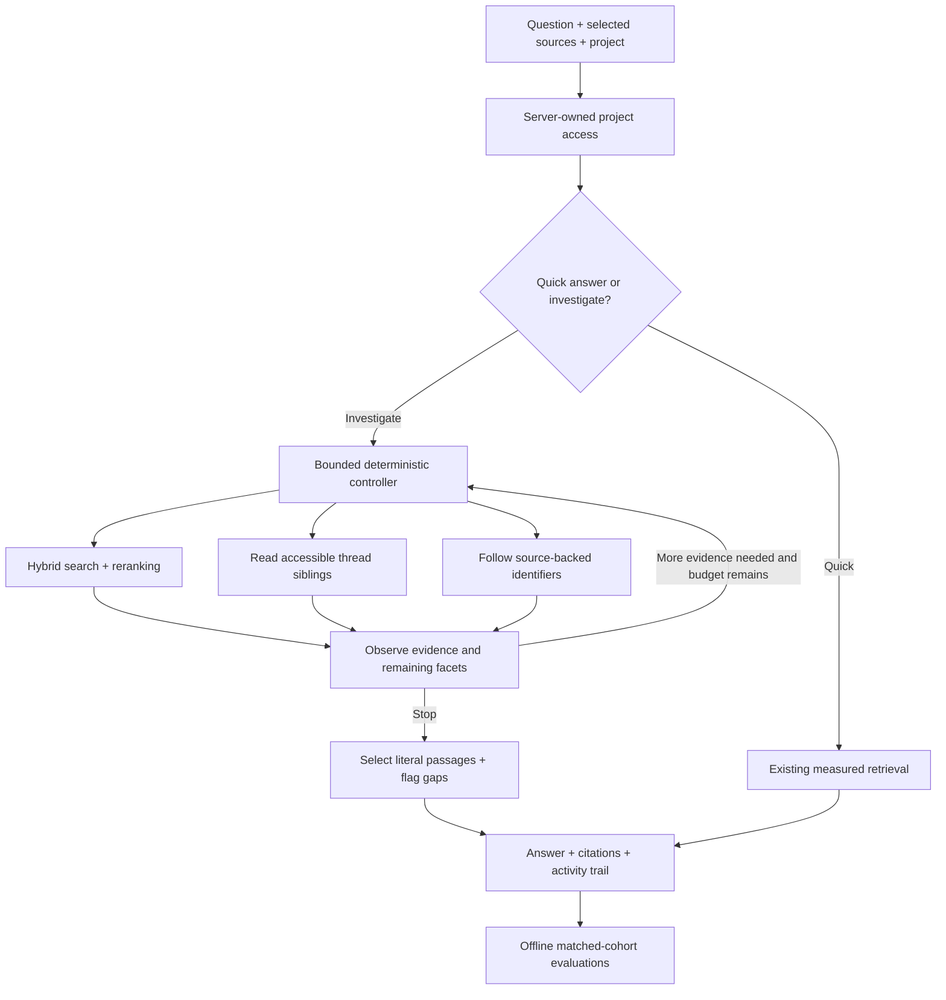

# Evidence-driven investigations

TraceLedger now supports a bounded agentic retrieval workflow: search, observe, choose a follow-up action, read conversation context, follow identifiers through the graph, and return exact cited passages with unresolved gaps. **The controller is deterministic, not an LLM planner.** It has no send, write, shell, arbitrary URL or credential tools.

## Demo

Select **Investigate a decision**, leave Documents, Email, Slack and Teams selected, and run:

> Investigate Project Alpha: why was commissioning delayed, who approved the change, and was the schedule updated?

The first results identify the engineering board approval, the schedule-register update and the incident. Expand the investigation activity to inspect actual tool calls. Click a citation and **Read full record** to inspect the source. A one-week vendor proposal remains context; it is not presented as the approved six-week delay. Uncheck Email and rerun to see the explicit approval gap. Ask about INC-999 to see abstention.

## Architecture



Maximum six actions and a 15-second soft deadline checked between actions. An in-flight local inference cannot be interrupted by this deadline. Thread reads cap at 20 current messages; final output caps at 12 cited records. Logs show tool actions and source IDs, not hidden reasoning. Source selection and access restrictions apply to search, graph traversal and thread expansion. Unknown identifiers do not fall through to nearby unrelated projects. All output remains untrusted evidence for user review.

## Measured checkpoint

Frozen policy evaluated on six held-out project investigations plus one missing-identifier case, after development on six different projects plus one missing-project case. Both approaches use the same evidence selector, maximum 12 cited records, and 255-record corpus (180 fictional project documents, 72 fictional messages and three public references), selected sources and local models. No real workplace communications were imported for these results.

| Held-out measure | Single-pass matched selector | Bounded investigator |
|---|---:|---:|
| Recall among first five cited documents | 47.6% | 71.4% |
| MRR among first five cited documents | 1.000 | 1.000 |
| nDCG among first five cited documents | 0.771 | 1.000 |
| Coverage across all cited documents | 47.6% | 95.2% |
| Label-based citation relevance | 100% | 100% |
| Exact citation integrity | 100% | 100% |
| Search/tool p95 | 402 ms | 644 ms |
| Total p95 | 403 ms | 645 ms |
| Measured external inference API spend | $0 | $0 |

Source: `reports/investigation-test.json`; per-question results are also in the Evaluation lab. This is protocol `atlas-investigation-evidence-v2`: ranking metrics use cited-document order, **not raw retrieval ranks**. The original document-retrieval cohort remains separate. Seven relevant records per answerable case means Recall@5 cannot exceed 5/7. Full-evidence coverage allows more citations and is not a like-for-like @5 improvement.

These small, templated synthetic cases are highly correlated; perfect relevance here is not an enterprise accuracy claim. The original broader document test still has 56.3% citation relevance. Independent human faithfulness ratings, live conversation tests and broad language coverage remain unmeasured. CPU/electricity costs are not estimated. Timing is a sequential local observation, not a statistical latency guarantee.

Development initially returned unnecessary thread context (61.1% citation relevance). Facet-based evidence selection improved development quality before freezing and running the held-out cases. The earlier runs remain in history. Investigation remains an explicit user-selected mode; quick retrieval is not replaced.

## Reproduce

```powershell
.venv\Scripts\python.exe scripts/build_conversations.py
.venv\Scripts\python.exe scripts/evaluate_investigator.py --split dev
.venv\Scripts\python.exe scripts/evaluate_investigator.py --split test --check
```

`--check` compares fresh results with the saved release before writing a restricted history record. CI gates Recall@5 and citation relevance within 0.02, exact citation integrity and abstention without regression, and total p95 below five seconds. Original document-regression checks use their original corpus; document-only quick search has its own index to prevent new conversation records changing BM25 statistics.

## Limits and next steps

- Rules recognize a narrow set of English project questions. This is bounded agentic retrieval, not general reasoning or autonomous project management.
- Message statuses in fixtures are authored ground truth. Reviewed imports deliberately default to unspecified; the controller cannot certify imported approvals or a sender's organizational authority.
- Conflict handling distinguishes known proposals and approval evidence; it does not reconcile arbitrary competing approved messages. Dates/statuses can be wrong.
- The source inventory is local. No OAuth, webhook, polling, native ACL synchronization, edit/delete synchronization or live email/Slack/Teams connection is implemented.
- Anonymous demo mode excludes private operator imports. Private imports inherit the selected TraceLedger project's access, requiring operator review first.
- Injection patterns are defense in depth, not a complete detector. No untrusted content is executable; citations establish provenance rather than truth.
- Next experiments: independent scenario authors, reviewed message-level labels, broader multi-hop questions, then an optional structured-output LLM planner tested against this deterministic controller. Add live provider adapters only with native permissions and revocation propagation.

Protocol v1 compared against the shorter quick-answer output. Protocol v2 uses the identical controller and final evidence selector with a one-action budget as its single-pass baseline, isolating follow-up actions from output-format differences. Older v1 runs remain visible in their own cohort. The policy was unchanged for the v2 rerun of the held-out project cases; these are repeated measurements, not a newly unseen dataset.
