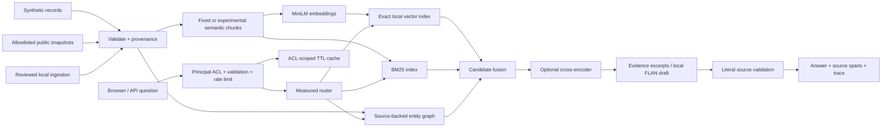
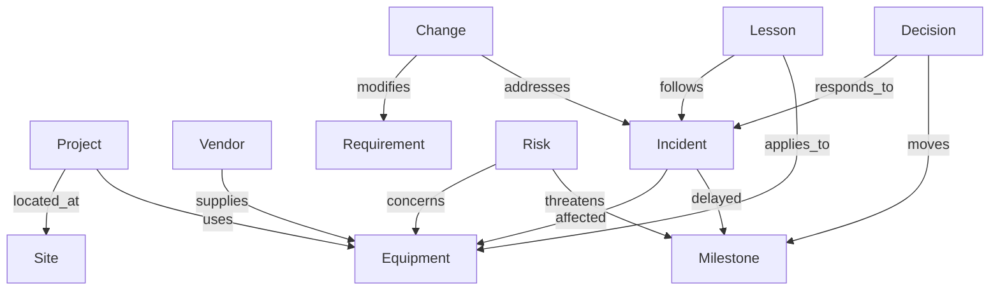

# Architecture and data contracts

`Document` carries a stable ID, project access scope, source URI, current/superseded flag, date, synthetic label and optional source-grounded edges. `Chunk` carries exact character offsets. Evaluation labels and the universe file are never loaded by the runtime. Ingestion writes validated JSONL, then a restart rebuilds the index and invalidates cached answers by corpus hash.

The embedding model is MiniLM-L6 through FastEmbed/ONNX, 384 dimensions. Fixed chunks contain at most 100 whitespace words with 20-word overlap before final bounding; pathological tokenization can still exceed the model's 256-token window. Semantic chunks use sentence embeddings and adjacent cosine boundaries, capped at 100 words. BM25 and dense retrieval fuse using reciprocal rank fusion (60 constant, top 40 candidates per method). A cross-encoder reranks 20 candidates; final results are deduplicated to five documents. Metrics therefore operate on unique documents, not chunks.

Graph edges originate in explicit source assertions, not evaluation answers. Every edge includes document ID and a literal supporting span, validated during indexing. Traversal uses an undirected multigraph for discovery while retaining the asserted relation label. Three-hop expansion checks source ACL at each edge. Ranking uses proximity and source aggregation. It is intentionally a lightweight, imperfect GraphRAG implementation: no community summaries, automatic arbitrary-document entity extraction, or Neo4j deployment. It can overretrieve related incidents and does not yet enforce active-project filtering as a typed graph predicate.

One process and a bounded inference lock keep CPU usage predictable. Structured HTTP traces include a request ID, status and duration; query events include route, cache state and hashed principal, without questions, source bodies or secrets. This is local structured tracing, not distributed OpenTelemetry. A reverse proxy, durable audit sink and external identity provider are production extensions.

The bounded investigation loop and conversation-source architecture are described in [agentic investigations](agentic-investigation.md). Quick document-only search preserves an independent document index; the mixed-source investigation is a separate evaluation cohort.
